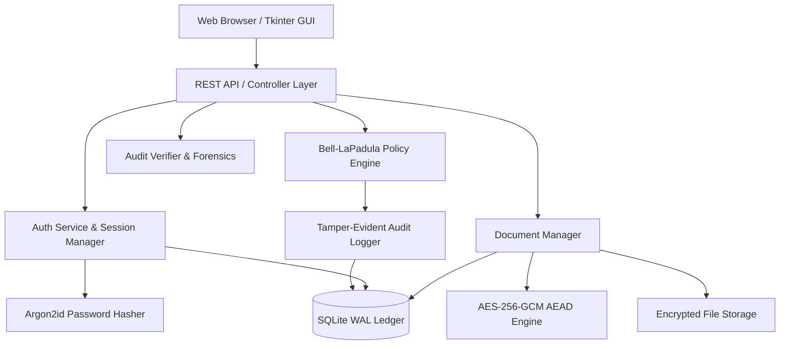

# ARCHITECTURE.md — AY Vault System Architecture

## Architecture Overview

## Security Layers
1. **At-Rest Protection**: Payload encrypted via AES-256-GCM with PBKDF2/Argon2 derived keys.
2. **Authorization Gate**: Every document read, export, modify, or delete passes through `PolicyEngine.evaluate()`.
3. **Forensic Integrity**: Tamper-detection via SHA-256 hash chaining prevents log alteration.
